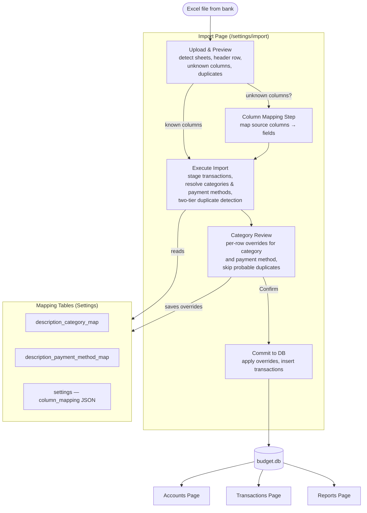

# App Flow — Visual Diagrams

## Page Navigation Flow

How the user navigates between pages and what triggers each transition.

```mermaid
flowchart TD
    Entry([App Load]) --> Accounts

    NavBar -->|"/"| Accounts
    NavBar -->|"/transactions"| Transactions
    NavBar -->|"/reports"| Reports
    NavBar -->|Settings button"| Settings

    Accounts -->|"Click category row"| Transactions_Cat["Transactions\n(?categoryIds=...)"]
    Reports -->|"Click category row"| Transactions_Cat

    Transactions_Cat -->|"Dismiss chip"| Transactions

    Settings -->|redirect| SettingsCat["Settings / Categories"]

    SettingsMenu -->|"Hidden Categories"| SettingsCat
    SettingsMenu -->|"Category Mapping"| SettingsMapping["Settings / Category Mapping"]
    SettingsMenu -->|"Payment Mapping"| SettingsPayment["Settings / Payment Mapping"]
    SettingsMenu -->|"Column Mapping"| SettingsColumn["Settings / Column Mapping"]
    SettingsMenu -->|"Databases"| SettingsDB["Settings / Databases"]
    SettingsMenu -->|"Import"| SettingsImport["Settings / Import"]

    Settings --- SettingsMenu["Left Menu"]

    subgraph Accounts["Accounts (/)"]
        AccCards[Account cards + monthly trend + top categories]
    end

    subgraph Transactions["/transactions"]
        TxTable[Transaction table + filters + quick stats]
    end

    subgraph Reports["/reports"]
        RepTable[Report tables by month / year / category]
    end

    subgraph Settings["/settings/*"]
        SettingsMenu
    end
```

---

## Import Data Lifecycle

How data flows from an Excel file into the database and read pages.


